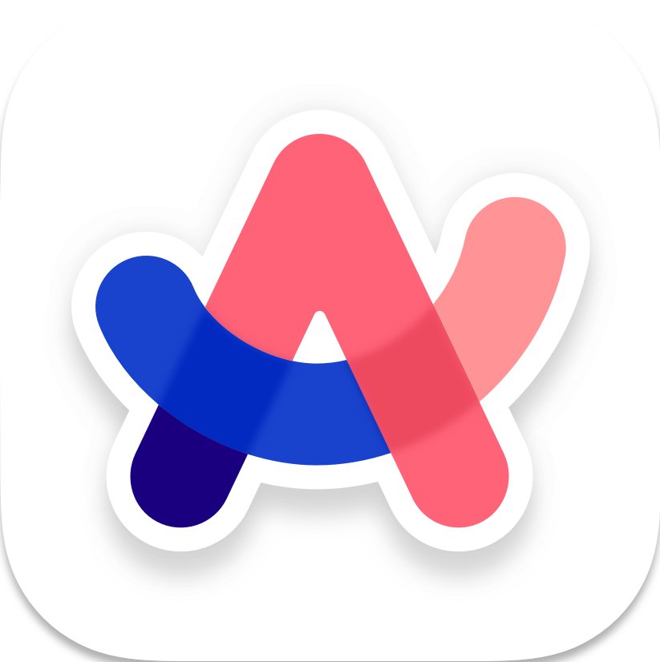
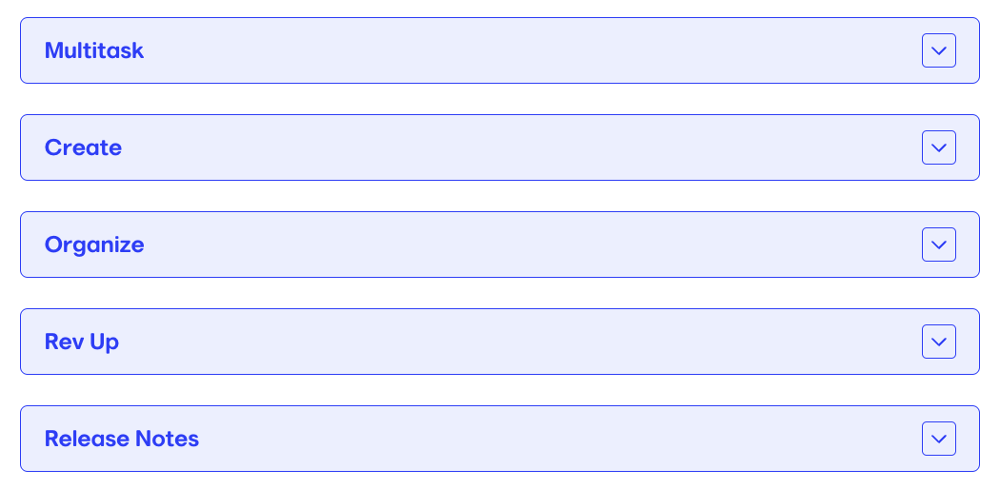
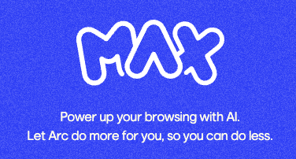
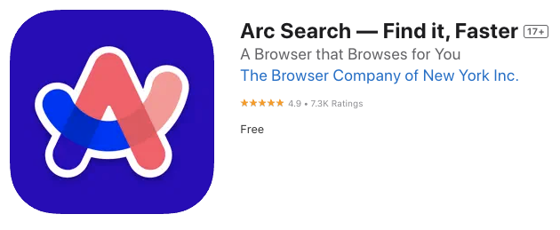

    
      Press Space for next page  <light-icon icon="arrow-narrow-right" size="24px"/> 
    

  

    ARC
  
 
  
    Un navigateur surpuissant <light-icon icon="rocket"/>
  
   

  
  

---
layout: cover
transition: slide-up
---

# Les présentations
Soyez pas si timides

---
layout: center
transition: slide-up
---

# The Browser Company <light-icon icon="briefcase"/>
Rien que ça

 

<light-icon icon="calendar"/> 2019

<light-icon icon="location"/> New York

<light-icon icon="man"/> Exs. Instagram, Tesla, Medium, Google

---
layout: center
transition: slide-up
---
# Arc c'est quoi ? <light-icon icon="target"/>
Si tu penses encore que c'est un truc pour tirer des flèches ...

 

<light-icon icon="calendar"/> 25 juillet 2023

<light-icon icon="code"/> Écrit en Swift

<light-icon icon="brand-chrome"/> Basé sur Chromium

---
layout: center
---
# Encore un navigateur ? <light-icon icon="browser"/>
J'ai déjà Chrome, Brave et Safari, tu veux quoi ?

 

<light-icon icon="bulb"/> Repenser l'utilisation d'un navigateur

<light-icon icon="brand-chrome"/> Tu gardes tes extensions et tes habitudes

<light-icon icon="award"/> C'est beau

<light-icon icon="brand-apple"/>Pensé pour mac, puis iPhone et maintenant Windaube

---
layout : cover
transition: slide-up
---

# Features <light-icon icon="list-numbered"/>
Y'en a genre deux ou trois

---
layout : center
transition: slide-up
---

# Multitask <light-icon icon="list-check"/>
Plus besoin d'être une femme

 

<light-icon icon="arrow-right"/> <a href="https://resources.arc.net/hc/en-us/articles/19335393146775-Split-View-View-Multiple-Tabs-at-Once">Split View</a>

<light-icon icon="arrow-right"/>  <a href="https://resources.arc.net/hc/en-us/articles/19335302900887-Peek-Preview-Sites-From-Pinned-Tabs">Peek</a>

<light-icon icon="arrow-right"/> <a href="https://resources.arc.net/hc/en-us/articles/19335284431639-Previews-Glance-Top-Sites">Previews</a>

<light-icon icon="arrow-right"/> <a href="https://resources.arc.net/hc/en-us/articles/19235387524503-Little-Arc-Quick-Lookups-Instant-Triaging">Little Arc</a>

<light-icon icon="arrow-right"/> <a href="https://resources.arc.net/hc/en-us/articles/19234766331799-Mini-Player-Watch-or-Listen-as-you-Browse">Mini Player</a>

---
layout : center
transition: slide-up
---

# Create <light-icon icon="pencil"/>
Libère le créatif en toi

 

<light-icon icon="arrow-right"/> <a href="https://resources.arc.net/hc/en-us/articles/20468488031511-Developer-Mode-Instant-Dev-Tools">Dev Mode</a>

<light-icon icon="arrow-right"/> <a href="https://resources.arc.net/hc/en-us/articles/19231142050071-Easels-Capture-Create">Easels</a>

<light-icon icon="arrow-right"/> <a href="https://resources.arc.net/hc/en-us/articles/19228534606743-Share-Spaces-Folders-Splits-with-Anyone">Share Spaces</a>

<light-icon icon="arrow-right"/> <a href="https://resources.arc.net/hc/en-us/articles/19212718608151-Boosts-Customize-Any-Website">Boosts</a>

---
layout : center
transition: slide-up
---

# Organize <light-icon icon="folders"/>
Stop aux 47 onglets ouverts

 

<light-icon icon="arrow-right"/> <a href="https://resources.arc.net/hc/en-us/articles/24158102740631-Live-Calendars">Live Calendar</a>

<light-icon icon="arrow-right"/> <a href="https://resources.arc.net/hc/en-us/articles/22932014625431-Air-Traffic-Control-Automate-Your-Link-Routing">Air Traffic Control</a>

<light-icon icon="arrow-right"/> <a href="https://resources.arc.net/hc/en-us/articles/22731612065815-Automatic-Github-Live-Folders">Github Live Folders</a>

<light-icon icon="arrow-right"/> <a href="https://resources.arc.net/hc/en-us/articles/19231060187159-Pinned-Tabs-Tabs-you-want-to-stick-around">Pinned tabs</a> / <a href="https://resources.arc.net/hc/en-us/articles/19230755904151-Favorites-Top-Tabs-Across-Every-Space">Favorites</a>

<light-icon icon="arrow-right"/> <a href="https://resources.arc.net/hc/en-us/articles/19230634389911-Library-A-home-for-your-downloads-archived-tabs-easels-and-more">Library</a>

---
layout : center
transition: slide-up
---

# Rev Up <light-icon icon="activity"/>
"To make it more active"

 

<light-icon icon="arrow-right"/> <a href="https://resources.arc.net/hc/en-us/articles/20855018192791-Site-Search-Directly-Search-any-Website">Site Search</a>

<light-icon icon="arrow-right"/> <a href="https://resources.arc.net/hc/en-us/articles/19335160678679-Arc-Max-Boost-Your-Browsing-with-AI">Arc Max</a>

<light-icon icon="arrow-right"/> <a href="https://resources.arc.net/hc/en-us/sections/20497738798231-Release-Notes">Release Notes</a>

---
layout : center
transition: slide-left
---

# Démo ? <light-icon icon="presentation"/>

Wow, il serait temps !

---
layout : center
transition: slide-left
---

# Arc Max <light-icon icon="rocket"/>
Pour un max de fun

---
layout: cover
transition: slide-left
---

# Arc Search <light-icon icon="zoom-in"/>
Pour ... chercher des trucs ?

